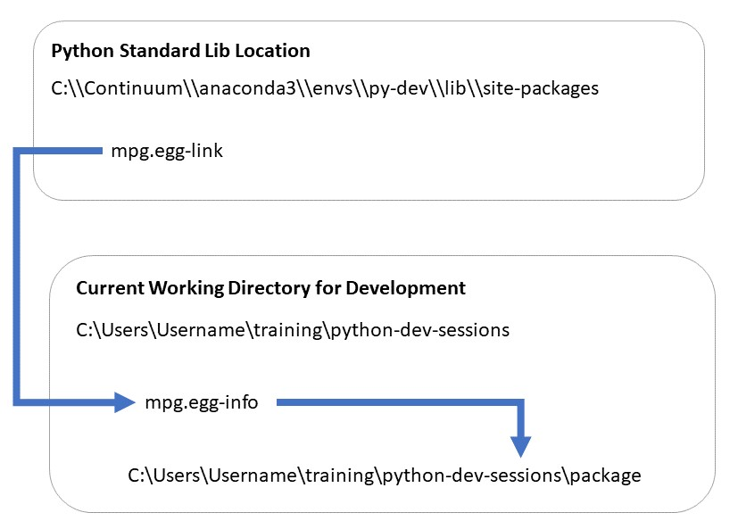

# Python Development Sessions

# Setup VS Code for Python Development

* Install VS Code
* Install VS Code Python Extension
* Create a new conda environment

# Session 1: Python Packaging

* Python packages vs module
* What happens when Python runs your code
* Imports, namespaces, relative, absolute etc.
  * https://realpython.com/absolute-vs-relative-python-imports/
  * Note that if a module has already been imported in a session it wont be re-imported

* The `setup.py` file
  * Minimal Working example
    * https://setuptools.readthedocs.io/en/latest/setuptools.html#developer-s-guide
  * Note name of overall library of packaged code v!= package names to include.
  * Use `find_packages()` When lots of packages and subpackages
  * Version - Use [Semantic Versioning](https://semver.org/)
  * Use install_requires to specify top level dependencies, their own dependencies will be installed.
  * Reference docs at https://setuptools.readthedocs.io/en/latest/

* Installing with pip
  * pip vs setuptools
    * Pip can uninstall, works better with conda, and provides an editable/develop mode.
  * pip editable mode
    * `pip install -e ./package`
    * Now you can make changes to files locally and they are reflected in the "installed" code

* Packaging
  * To create a source distribution
    * `python setup.py sdist`
  * To create a binary distribution
    * `python setup.py bdist`

# Session 2: Python Packaging II, including non Python files

* Handling non python files requires two steps:
  * Referring to them in code
    * Using Path in [pathlib](https://docs.python.org/3/library/pathlib.html) with __file__
    * or Resource manager API https://setuptools.readthedocs.io/en/latest/pkg_resources.html#resourcemanager-api
  * Specifying what to include in setup.py
    * https://setuptools.readthedocs.io/en/latest/setuptools.html#including-data-files

* pip `requirements.txt` files and conda `environment.yaml` files
* pipenv, poetry, flit and all manor of other tooling (that you probably don't need to know!)

# Session 3: Testing with Pytest

* Recap of testing & its importance
  * An automated set to checks to prove a feature of the code works as expected
  * Provides a level of confidence that certain things work, and quick feedback when they don't!
  * Allows you to make changes with confidence
  * Only then can you refine and improve the code without fear or frustration!

* Example functionality we wish to test
  * Config file loading/setting
  * Data manipulation

* The Pytest library
  * Setting up our project to use tests
  * Basic example or test and usage
    * Layout
    * Writing tests as functions matching `test_*()` in files matching `test_*.py`
    * Importing the library, easy if pip (-e) installed.
    * Run all tests with: `pytest /path/to/tests`

  * **Potential Pitfall**: Making test directory a package
    * TLDR: don't put a `__init__.py` file in the `tests/` directory. It's fine in any sub directory further down though.
    * Means that pytest needs to add the directory `/package` to the path in order to import tests
    * As `mpg` is at the same level, this means imports in the test now use the local code not the installed code.
    * This can cause issues, typically when non python files are not installed correctly. Your tests
  will pass, but only because they are running against the local version of the code, not the
  installed version.
    * More details: https://docs.pytest.org/en/latest/goodpractices.html#choosing-a-test-layout-import-rules

  * Test data files
    * Layout
    * Set path using `Path(__file__)`

  * Test Coverage
    * Install `pytest-cov` plugin
    * Use with `pytest /path/to/tests --cov <package_name>`
    * HTML report with `pytest /path/to/tests --cov <package_name> --cov-report html`

# Session 4: Testing with Pytest II

  * Some useful flags
    * `--pdb` drop into python debugger as the first failing test
    * `-v` or `-vv` Give more verbose output of assert outputs
    * `-x` quite after the first fail

  * Fixtures
    * Setup resources for a test
    * Have scope and autouse parameters
    * Some inbuilt:
      * `tmp_path`: https://docs.pytest.org/en/latest/tmpdir.html
      * `monkeypatch`: Useful for setting environment variables https://docs.pytest.org/en/latest/monkeypatch.html
      * `capfd`, `caplog` : Capture output to stdout, stderr or to logs https://docs.pytest.org/en/latest/capture.html#accessing-captured-output-from-a-test-function
    * Can work with `yield` to also do teardown
    * The `conftest.py` file can used to declare common fixtures for tests in the same folder

  * Config File
    * Either `pytest.ini`, `setup.cfg`
    * https://docs.pytest.org/en/latest/customize.html

  * Testing for Errors and Warnings
    * https://docs.pytest.org/en/latest/assert.html#assertions-about-expected-exceptions
    * Using context managers
      * `with pytest.raises():`
      * `with pytest.warn():`

  * Marks
    * Parameterise Tests https://docs.pytest.org/en/latest/parametrize.html#parametrize-basics
    * Skipping tests and expected fails (xfail) https://docs.pytest.org/en/latest/skipping.html
